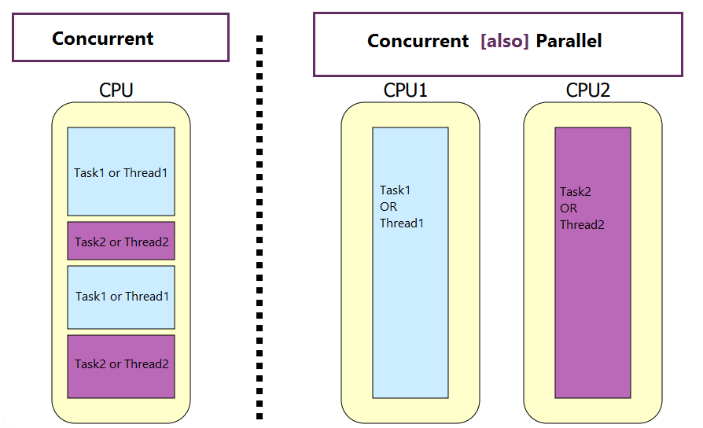
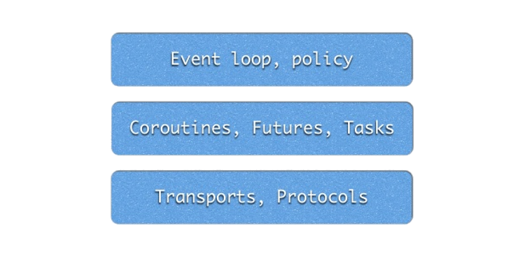

<!-- $theme: default -->

# I/O Asincrono en Python

---

# repr(self)

```python
>>> from Tenerife import Sergio
>>> Sergio.full_name()
"Sergio Medina Toledo"
>>> Sergio.work()
["VoIP", "Django", "Microservices", "Scalability"]
>>> Sergio.others()
["DevOps", "Linux", "Security", "Architectures"]
>>> Sergio.languages()
["Python", "C", "C++", "js"]
>>> Sergio.job()
<backend.Developer at System73>
>>>  
```

---

# Concurrencia y Paralelismo



---
# Concurrencia


Ejecucion de varias tareas a la vez

* Procesadores superscalares (Paralelismo)
* Multithreading (Paralelismo)
* Multiprocessing (Paralelismo)
* Pipeline (Paralelismo)
* Event loop


<!-- footer: {"Reference": "https://jmtorres.webs.ull.es/me/2013/04/introduccion-a-la-concurrencia/"} -->

---

# `def blocking_io()`
Una funcion o bloque de codigo es bloqueante si tiene que esperar por algo a que se complete
```python
import sys

sock = socket.socket(socket.AF_INET,socket.SOCK_STREAM)

sock.bind(('localhost', 1234))
sock.listen(5)

try:
    while True:
        conn, info = sock.accept()
        data = conn.recv(1024)
        while data:
            data = conn.recv(1024)
            print(data)
            
except KeyboardInterrupt:
    sock.close()
````

<!-- footer:  -->

---

# `def non_blocking_io()` boilerplate
```python
CONNECTION_LIST = []  # list of socket clients
server_socket = socket.socket(
	socket.AF_INET, socket.SOCK_STREAM
)
server_socket.setsockopt(
	socket.SOL_SOCKET, socket.SO_REUSEADDR, 1
)
server_socket.bind(("0.0.0.0", 1234))
server_socket.listen(5)

# Add server socket to the list of readable connections
CONNECTIONS.append(server_socket)
```
---

# `def non_blocking_io()`
```python

while True:
    read_sockets, write_sockets, error_sockets = \
    	select.select(CONNECTIONS, [], [], timeout=0)

    for sock in read_sockets:

        # New connection
        if sock == server_socket:
            sockfd, addr = server_socket.accept()
            CONNECTIONS.append(sockfd)

        # Some incoming message from a client
        else:
            try:
                data = sock.recv(1024)
                if data:
                    print(data)
            # client disconnected
            except:
                sock.close()
                CONNECTIONS.remove(sock)
```

---
# `Asyncronous.io.abstractions.flavours()`

```python
>>> Asyncronous.io.abstractions.flavours()
[
	"Futures",
	"Coroutines",
	"Callbacks",
	"Events",
	"Defereds",
	"stackless",
	"Awaitables"
]
```
---
# `Asyncronous.io.python.flavours()`

```python
>>> Asyncronous.io.python.flavours()
{
"asyncore std 1.0": "Callbacks",
"stackless": "Microthreads",
"greenlet": ["Microthreads", "Spin-off of Stackless"],
"eventlet": ["libevent", "C", "Coroutines", "greenlet"],
"twisted": ["Defereds", "Callbacks"],
"tornado": ["Coroutines", "Callbacks"],
"pyuv": ["libuv", "C", "nodejs"],
"gevent": ["libev", "C", "Coroutines", "MonkeyPatching"
	"greenlet"],
"asyncio": ["std", "3.4","Futures", 
	    "Coroutines", "Callbacks", "Awaitables"]
"curio": "Coroutines"
}
```

---
# Asyncio
```python
>>> import asyncio
>>> dir(asyncio)
[
	"PEP-3156",
	"3.3 >=",
	["unix", "windows"],
	["IPv4", "IPV6"],
	["TCP", "UDP", "Pipes"] ,
	"SSL",
	"Subprocess",
	"Signals",
]
```
---
# Componentes de Asyncio



---
# Async/Await 

Sintaxis de py3.5 para trabajar con corrutinas

```python
async def my_coroutine():
	await other_corroutine()
```

Sintaxis pre py3.5
```python
@asyncio.coroutine
def my_coroutine():
	yield from other_corroutine()
```

---
# `asyncio.apis.streams()`
```python
>>> asyncio.apis.streams()
[
	"TCP wrapper",
	"UNIX Sockets wrapper",
	"Coroutine based API",
	"StreamReader",
	"StreamWriter",
	"SSL Support"
]
```
---
# Client
```python
class Client:
    def __init__(self, loop):
        self.loop = loop
        self.reader, self.writer = None, None

    async def connect(self):
        self.reader, self.writer = await \
        asyncio.open_connection(
        	LISTEN_IP, 
        	LISTEN_PORT,
        	loop=self.loop
            )

    async def send_data(self, data: bytes):
        data_len = len(data)
        data_len_in_bytes = data_len.to_bytes(
        	4, 
            	byteorder='big'
            )
        self.writer.write(data_len_in_bytes)
        self.writer.write(data)
```

---
# Client
```python
 async def read_data(self):
        data_len_in_bytes = await self.reader.read(4)
        data_len = int.from_bytes(
        	data_len_in_bytes, 
            	byteorder='big'
            )
        data = await self.reader.read(data_len)
        return data

    def close(self):
        self.writer.close()
    
    def read_data_iter(self):
        return self
        
    async def __aiter__(self):
        return self

    async def __anext__(self):
        try:
            return await self.read_data()
        except IncompleteReadError:
            raise StopAsyncIteration
```
---
# Client usage
```python
async def read_task_coro(client):
    async for data in client.read_data_iter():
        print(data)

async def write_task_coro(client):
    for _ in range(1, 100):
        client.send_data(b"ping")
        await asyncio.sleep(1)

async def start(loop):
    client = Client(loop)
    await client.connect()
    read_task = asyncio.ensure_future(
        read_task_coro(client)
    )
    write_task = asyncio.ensure_future(
        write_task_coro(client)
    )
    await asyncio.sleep(100)
    read_task.cancel()
    write_task.cancel()
```
---

# Start server boilerplate
```python
def start_server():
    loop = asyncio.get_event_loop()
    server_fut = asyncio.start_server(handle_connection, 
    	LISTEN_IP, LISTEN_PORT, loop=loop)
        
    server = loop.run_until_complete(server_fut)

    # Serve requests until Ctrl+C is pressed
    print('Serving on {}'.format(
    	server.sockets[0].getsockname()))
    try:
        loop.run_forever()
    except KeyboardInterrupt:
        pass

    # Close the server
    server.close()
    loop.run_until_complete(server.wait_closed())
    loop.close()

if __name__ == "__main__":
    start_server()
```

---
# Server logic

```python
writers = []


async def handle_connection(reader, my_writer):
    writers.append(my_writer)
    try:
        while True:
            message_length_bytes = await reader.read(4)
            message_length = int.from_bytes(
            	message_length_bytes, byteorder='big')
            message = await reader.read(message_length)
            for writer in writers:
                if writer != my_writer:
                    writer.write(message_length_bytes)
                    writer.write(message)
    except IncompleteReadError:
        writers.remove(my_writer)
```
---
# Conclusiones

* Sincrono, io bloqueante
* Asincrono, io no bloqueante
* Paralelismo, en el mismo instante de tiempo (CPU Bound)
* Concurrencia, tareas ejecutadas a la vez, en el mismo o diferente instante de tiempo
* IO asincrono para tareas IO Bound
* Problema c10K, c100K, c1M

---
# Referencias

Esta charla es una adaptacion y actualización de la [charla de saghul en la pyconES 2013](https://es.slideshare.net/saghul/pep3156-async-io-in-python) actualizada 

Otras referencias:

[PEP 492 -- Coroutines with async and await syntax](https://www.python.org/dev/peps/pep-0492/)

[PEP 3156 -- Asynchronous IO Support Rebooted: the "asyncio" Module](https://www.python.org/dev/peps/pep-3156/)

[I don't understand Python's Asyncio](http://lucumr.pocoo.org/2016/10/30/i-dont-understand-asyncio/)

[Some thoughts on asynchronous API design in a post-async/await world](https://vorpus.org/blog/some-thoughts-on-asynchronous-api-design-in-a-post-asyncawait-world/)

---
 
We are Hiring !!

* [Junior to mid-level Software Engineer](https://drive.google.com/file/d/0B2sfo-yI6ecGSXRReTlaVHpVWXdsTVJnYVA1Y2RMYXhlNU5z/view)

* [Junior to mid-level DevOps Engineer](https://drive.google.com/file/d/0B2sfo-yI6ecGLXVHXzhMbHBhZnBleVFlRC1vUFFKU2o4aFRj/view)

* [Junior Software Engineer](https://drive.google.com/file/d/0B2sfo-yI6ecGWDkwdEtJdXgwVjhXeWhuWDU4S0dpbHJfTmc0/view)

* [Junior Quality Assurance Engineer](https://drive.google.com/file/d/0B2sfo-yI6ecGTW4yb3BDQVVBU0ZGdFZ0OWdQZ0sxaVctdXBv/view)

Send your cv in english to :

carrers@system73.com

---
# Agradecimientos

* A todos los asistentes
* Organización del pyday
* Patrocinadores
* A mis amistades que me han echado una mano para hacer la charla y los ejercicios

